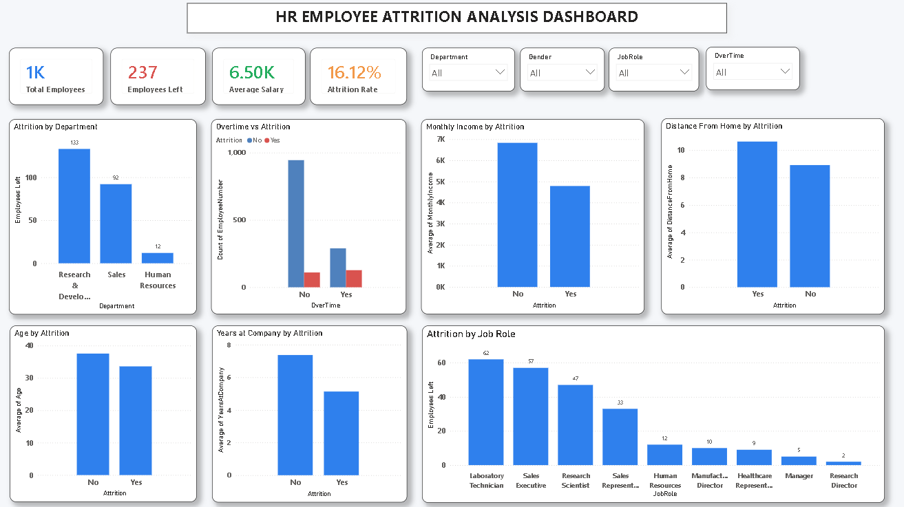
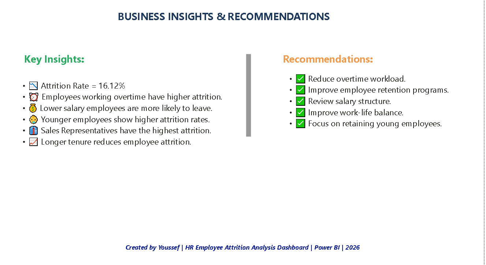

# HR Employee Attrition Analysis Dashboard | Power BI

## Project Overview

This project analyzes employee attrition patterns using HR data to identify the key factors influencing employee turnover and provide actionable business recommendations.

---

# HR Employee Attrition Analysis Dashboard

## Main Dashboard

## Business Insights & Recommendations

## Objective
- Analyze employee attrition patterns.
- Identify factors affecting employee turnover.
- Evaluate employee demographics and behavior.
- Provide business recommendations.

## Tools Used
- Power BI
- DAX
- Python
- Pandas

---

## Key KPIs

* Total Employees: 1470
* Employees Left: 237
* Attrition Rate: 16.12%
* Average Salary: 6.5K

---

## Key Insights

* Employees working overtime have higher attrition rates.
* Lower salary employees are more likely to leave.
* Younger employees show higher attrition rates.
* Sales Representatives have the highest attrition.
* Employees with longer tenure are less likely to resign.

---

## Business Recommendations

* Reduce employee overtime workload.
* Improve employee retention programs.
* Review salary structures.
* Improve work-life balance.
* Focus on retaining younger employees.

---

## Author

Created by **Kamal** using **Power BI**.
